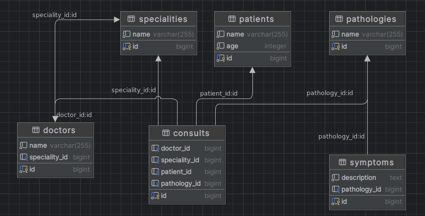
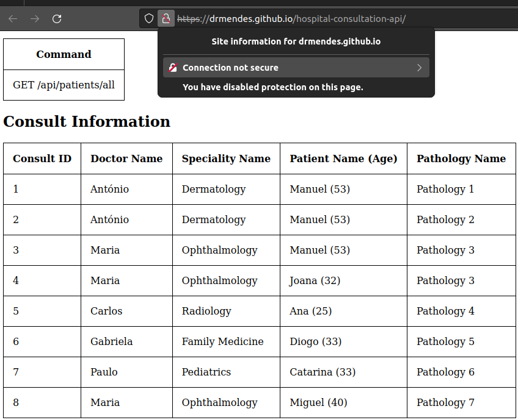

# **Hospital Consults API**


## Table of Contents
- [Overview](#overview)
- [Prerequisites](#prerequisites)
- [Building and Running Locally](#building-and-running-locally)
- [Thought Process](#thought-process)
- [Database](#database)
- [Future Enhancements](#future-enhancements)
- [Conclusion](#conclusion)

## **Overview**

This repository serves the purpose of fulfilling an assignment presented by [Körber Pharma](https://www.koerber-pharma.com).
This task involves the Spring Boot implementation of a backend API for logging consults in a hospital.
It helps keep track of patient consults, pathologies, and associated symptoms.
Furthermore, it encompasses CI/CD and IaC as optional tasks.

### Prerequisites
- Java 17 JDK
- Docker
- A Kubernetes cluster (optional, for deployment)


### Building and Running Locally
There are three main ways to build and run the application:
- local (docker-composer)
- local cluster (MiniKube)
- cloud cluster (GKE)

## 
1. Locally via docker-compose:
```bash
   make deploy-local # to clean: make clean-local
```

2. Minikube (assumed installed):
```bash
  make deploy-minikube # to clean: make clean-minikube
```
If successful returns the url to get the api documentation.

3. GKE:
```bash
  make deploy-gke # to clean: make clean-gke
```


### **Thought process**
I divided the assignment into distinct parts:
- Database design
- Spring Boot configuration
- Define Controllers, Services, Entities, tests, etc
- Make it deployable locally via Makefile
- Set up CI/CD through GitHub actions
- Set up IaC with terraform to deploy a GKE cluster with postgresql and the app


## **Database**
Regarding the database design, given the data provided and the queries yielded from the requested endpoints gave a clear
insight into what it should be.
This simple structure allows for flexibility in adding new patients, pathologies, or symptoms without duplicating data:

Relations:

- **Doctor-Patient Relationship**:
  - Type: Many-to-many through the Consult entity.
  - Description: A doctor can have multiple patients through multiple consultations, and a patient can see multiple doctors.

- **Consult-Pathology Relationship**:
  - Type: One-to-many.
  - Description: A consultation can diagnose one pathology, but a pathology can be diagnosed in multiple consultations.

- **Consult-Symptom Relationship**:
  - Type: Many-to-many.
  - Description: A consultation can record multiple symptoms, and a symptom can be observed in multiple consultations.




Doctors and Specialities have a one-to-one relationship. I considered having Speciality as an attribute of Doctor but
there was too much logic involved with Speciality. It is also closer to the realistic approach of Many-to-One
Doctor-Speciality relationship.
Apart from this each consult has a foreign key from doctor, patient, speciality and pathology.

As for ORM I decided to go with Hibernate as it's widely used with Spring Boot and offers powerful features out-of-the-box.
It abstracts away the database operations, allowing for cleaner and more maintainable code.

Lastly, for Database Migrations I chose Flyway. It ensures the database schema is consistent across all environments
and it is straightforward to work with.

The files for migration are under ``/src/main/resources/db.migration``.
`V1_Initial_schema.sql` has the schema and `V2_data_bootstrap.sql` migrates to a database with the data that was
provided on the assignment.


## **API Endpoints (Objective 1)** ##
To fulfill the required functionality the following endpoints had to be implemented:

### Create consults Endpoint:
**POST /api/consults**

Example POST request body:
  ```json
  {
      "doctor": "Maria",
      "patient": "Manuel",
      "pathology": "Pathology 1" // optional
  }
  ```
Should respond with 201 :
  ```json
  {
      "doctor": "9",
      "patient": "Maria",
      "speciality": "Manuel",
      "pathology": "Pathology 1"
  }
  ```

### Get patient consults and symptoms Endpoint:
**GET /api/patients/{patientId}/consults-symptoms**

Example response for GET /api/patients/2/consults-and-symptoms:
  ```json
    { // 200 OK
      "Consults": [
        {
          "ConsultId": 4,
          "Doctor": "Maria",
          "Speciality": "Ophthalmology"
        }
      ],
      "Symptoms": [
        {
          "SymptomId": 6,
          "Description": "Symptom 6 description"
        },
        {
          "SymptomId": 7,
          "Description": "Symptom 7 description"
        }
      ]
    }
  ```


### Top Specialties:
**GET /api/specialties/top**

Example response for GET /api/specialities/top?threshold=2:
```json
  [ // 200 OK  
    {
      "patientCount": 3,
      "SpecialtyName": "Ophthalmology",
      "NumberOfPatients": 3
    }
  ]
```
It has an optional parameter threshold which determines the minimum number of unique patients to be considered a
top speciality. If not specified it defaults to 2.


### All Patients:
**GET /api/patients**

This endpoint will return the data for all the patients with pagination, filtering and sorting by either age or
name.
Example response for GET /api/patients/all?age=40&name=Miguel:
  ```json
  { // 200 OK
    "filter": {
      "name": "Miguel",
      "age": 40
    },
    "patients": [
      {
        "id": 6,
        "name": "Miguel",
        "age": 40
      }
    ],
    "totalPages": 1,
    "sort": {
      "direction": "asc",
      "type": "name"
    },
    "currentPage": 1,
    "totalElements": 1
  }
  ```

### Get consults information:
**GET /api/consults/info**

This is an extra endpoint which returns useful state information of the database. It returns the state of the
database similar to the table provided on the assignment.

Example response for GET /api/patients/all?age=40&name=Miguel:
  ```json
  [ // 200 OK
    {
      "consultId": 1,
      "doctorName": "António",
      "specialityName": "Dermatology",
      "patientName": "Manuel",
      "patientAge": 53,
      "pathologyName": "Pathology 1"
    },
    {
      "consultId": 2,
      "doctorName": "António",
      "specialityName": "Dermatology",
      "patientName": "Manuel",
      "patientAge": 53,
      "pathologyName": "Pathology 2"
    }
   // (...)
  ]
  ```

### Get recent commands:
**GET /api/recent-commands**

This is an extra endpoint which returns the last 10 endpoints hit.

Example response:
  ```json
  [ // 200 OK
    "GET /api/patients/all"
  ]
  ```


## **Extra docs/index.html**
To get an overview of the state of the database I included an index.html file which is hosted in Github Pages.
The page shows the last endpoints hit (through recent-commands endpoint) and a table showing the current state of the
database.
I configured CORS so that the page can make requests to the two extra endpoints and display the data.
As I have a running instance of challenge-app on a GKE cluster, we can visit it at this
[github page](https://drmendes.github.io/hospital-consultation-api/).



A side note is that the browser expects all assets and requests made by the page to also be served over HTTPS.
If any requests are made over HTTP, they are considered "insecure" and will likely be blocked.
This could be done by serving the backend over HTTPS or with a reverse proxy.

### **Swagger & OpenAPI 3.0** ####
The application serves the endpoint to retrieve the open API specification through springdoc on the endpoint:
```
  GET /v3/api-docs
```
This will return the OpenAPI specification in JSON format.

## **Tests** ##
Tests can be run with make:
```
  make tests
```
I have tried to cover tests, especially for the endpoints required on the assignment. Both tests on the service and
controller layer.
Some tests were designed with a unit-testing mindset, focusing on individual components in isolation, while others
leaned more towards integration testing, examining the interactions between components and their overall integration.

For a more holistic testing approach, it would be ideal to connect to an external SQL server on the CI pipelines,
allowing for full-fledged integration tests. This would simulate a real-world environment more closely.

## Branching
The idea of the repository is to be comprised of three types of branches:

- **Feature branches:** These are created by developers for each new feature or bug fix. The branch is named after the feature or the bug fix.
- **Development branch (develop):** This is the main branch where the code is at the edge. All feature branches are merged into this branch.
  On pull requests, a workflow is triggered running linting and tests.

- **Production branch (main):** This branch mirrors the code in production. On pull requests, a workflow is triggered
  running linting, unit-testing, (ideally) integration testing and testing the build.


## **CI/CD Pipeline (Objective 2)** ##
I have set up a CI/CD pipeline using GitHub Actions.
The workflow **release-trigger.yaml** is triggered on release published.
Being triggered dispatches to the IaC repository.
This informs the IaC repository that a new release has been published and it can change the app version.

The **feature-branch.yaml** runs build and tests on any push that is not main or develop. This is so that every feature
branch is guaranteed to be passing tests.

The workflow **on-release** is triggered on release. This builds and pushes the new docker image to the registry.

## **IaC** (Objective 3) ##
The repository [hospital-infra](https://github.com/drmendes/hospital-infra) contains the Terraform code to create the GKE cluster with a Postgresql and a
Challenge-app instances.
On this repository there is a workflow terraform-update.yaml which contains:
````
on:
repository_dispatch:
types: [challenge-app-release]
````
This is the workflow that **release-trigger.yaml** on challenge-app effectively triggers.
The workflow **deploy-gke.yaml** is triggered manually to deploy the cluster and the apps.

Unfortunately, ``terraform apply` was taking too long to run on GitHub Actions and I opted to deploy the apps on a
GKE cluster without terraform. I did not debug, but I believe the problem was service account permission related.

To deploy to a GKE cluster (with proper kubectl configuration for the cluster) use the command:
```bash
    make deploy-gke # to clean use: make clean-gke 
```
This will apply the manifests in ``.chart/manifests-gke`` (in the beginning I was pondering using helm, thus the slightly bad naming ``.charts``).


## **Future Enhancements**

- **Port Configuration**: The application is configured to run on port 8080. In production scenarios, it's advised to have a reverse proxy (like Nginx or HAProxy) in front of the application to handle SSL termination and load balancing.
- **Monitoring**: Integration with Prometheus and Grafana for real-time monitoring.
- **Logging**: Integrate tools like the ELK Stack.
- **Scalability**: Implement a more distributed architecture, possibly introducing microservices.
- **Security**: Implement JWT-based authentication and introduce HTTPS.
- **Database Growth**: If the database grows large, table partitioning can be used, especially for tables like Consult which might have a lot of data.
- **Indexing**: Use of primary keys and foreign keys inherently act as indexes, improving query performance. If certain queries are run frequently, additional indexes can be added to those columns.
- **Testing**: Add more test coverage and had integration tests.
- **Repository Visibility**: The repositories should be private. For the sake of experience, I chose to try Github Pages. For the latter, I had to leave the repository public. I am aware this is not a good practice.

## **Conclusion**
While I was unable to fully set up with IaC and achieve a more polished and secure representation of the database,
the assignment was engaging. The extensive tooling involved added an immediate layer of excitement. I look forward to your review and value any feedback you can provide. Please raise any issues or pull requests if you have suggestions or improvements!